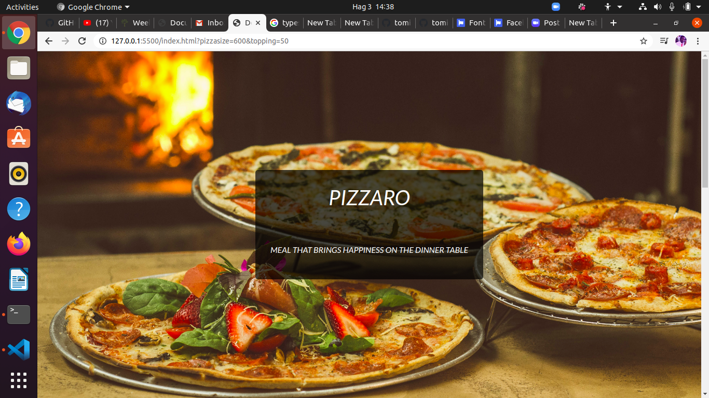

# Pizzaro
This project is about  pizza business.The project mainly focused on its interactiveness and layout.



## Author
 * Thomas Khaemba 

## Project Setup
The project  is accessible  on my git hub where you can copy the [repository](https://github.com/tomito26/pizzaro-pizza.git) and clone it into your local machine by following the steps below:

After copying the repo you paste it after writing the git command on your terminal
```
$ git clone <repo>
```
You then go to the directory/folder  of the project you just cloned

```
$ cd directory
```
 Then type [code .]() command for restarting the Vs code or [atom .]() for atom IDE
 ```
$ code . 
 ```
